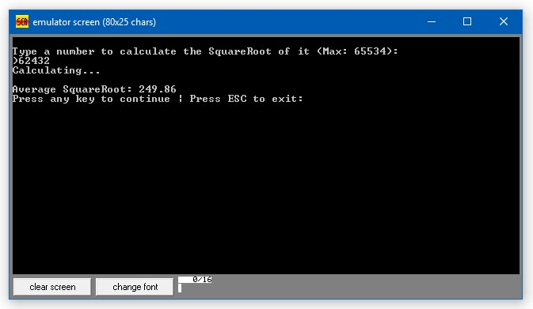

# Sqrt8086
Sqrt8086 is a Square Root calculator made for Intel 8086 Architecture written in Assembly 8086.

The main goal of this experiment is to try  to calculate a square root with decimal precision without having floating point on the processor itself. 

